# 롤업
롤업은 인기 게임 리그오브레전드 유저 매칭 서비스입니다. <br>
유저들은 원하는 파트너를 찾기위해 다양한 커뮤니티에 모집글을 올리곤 했습니다. <br>
유저 매칭 플랫폼을 형성하고 유저들의 불편함을 해소하기 위해 '롤업'을 기획하게 되었습니다.

- 롤업: http://d2fh37v4sikqk8.cloudfront.net/
- 백엔드 소스코드: https://github.com/khj1/lolup-backend-project
- 프론트엔드 소스코드: https://github.com/khj1/lolup-frontend-project

<br>

---
## 사용방법

---

### 로그인
> 카카오, 구글로 로그인할 수 있습니다.

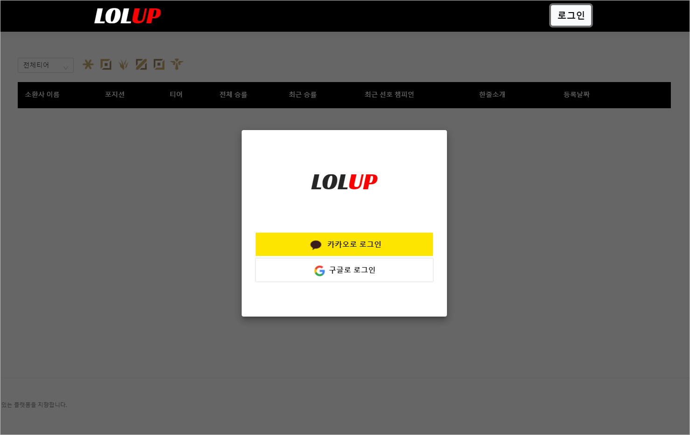

<br>

### 소환사 이름 등록
> 첫 로그인 후 소환사명을 등록해야합니다. <br>
> 리그오브레전드에 등록된 소환사명만 등록할 수 있습니다.

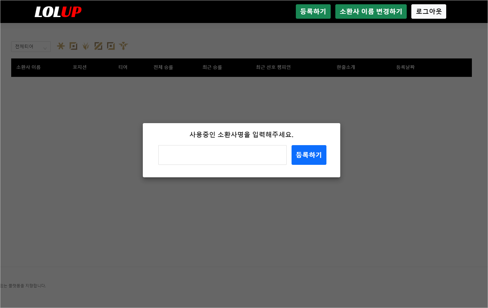

<br>

### 소환사 이름 변경
> 소환사 이름은 언제든 변경할 수 있습니다.

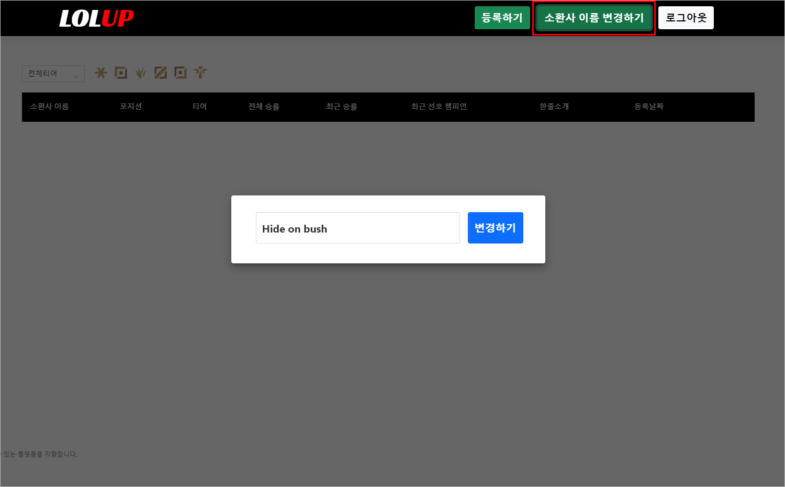

<br>

### 모집글 등록
> 등록된 소환사명을 기반으로 모집글을 등록할 수 있습니다. <br>
> 5초마다 새롭게 등록된 게시물이 업데이트될 수 있도록 구현했습니다.

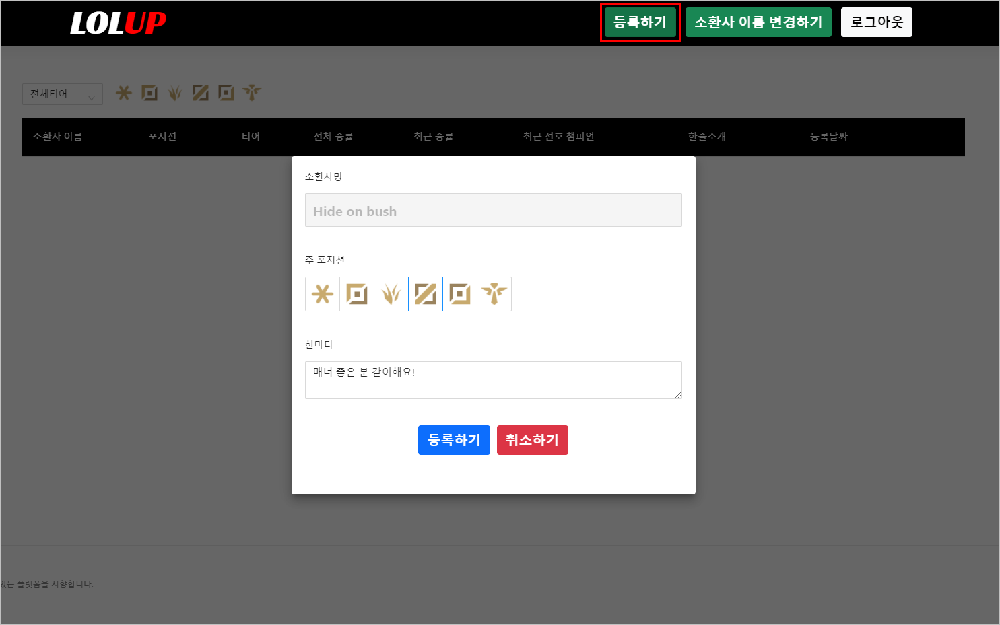

<br>

> RIOT API에서 데이터를 받아와 유저의 최신 전적 정보를 반영했습니다.

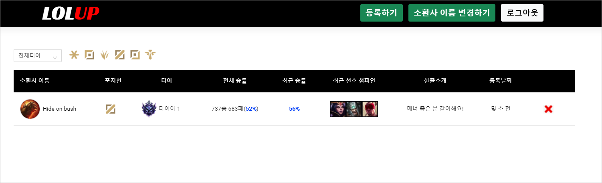

<br>

### 모집글 추가 조회
> 게시글이 20개를 초과하면 '더보기' 버튼을 통해 20개의 데이터를 추가로 불러올 수 있습니다.

<br><br>

### 모집글 필터링
> 티어와 포지션에 따라 게시글을 필터링할 수 있습니다.

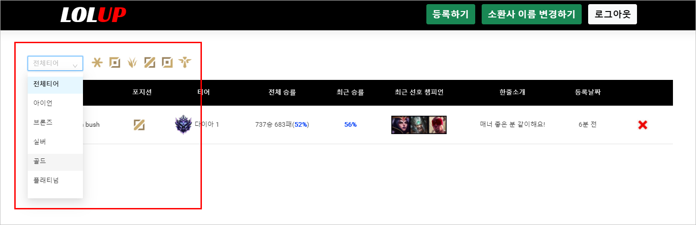

<br>

### 채팅 기능
> 함께 플레이하고 싶은 유저에게 메시지를 보낼 수 있습니다. <br>
> 자신의 게시글에는 채팅 버튼 대신 삭제 버튼이 표시됩니다.

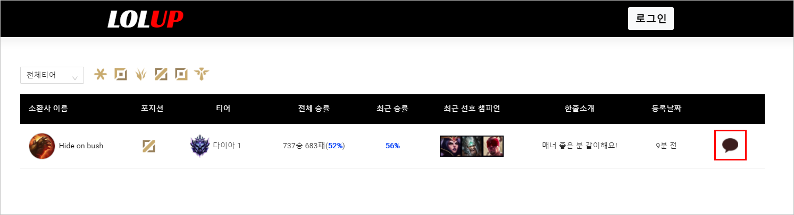

<br>

> 화면 하단의 채팅 버튼을 통해 채팅방에 입장하고, 받은 메시지를 확인할 수 있습니다. <br>
> 로그아웃 상태에서는 버튼이 표시되지 않습니다.

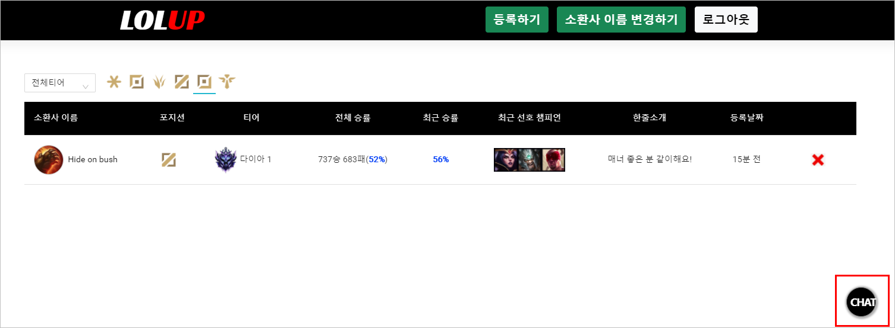

<br>

> 화면 하단의 버튼을 클릭하면 '나에게온 채팅'으로 표시되고, <br>
> 게시물 우측의 버튼을 클릭하면 '~님과의 채팅'으로 표시됩니다.

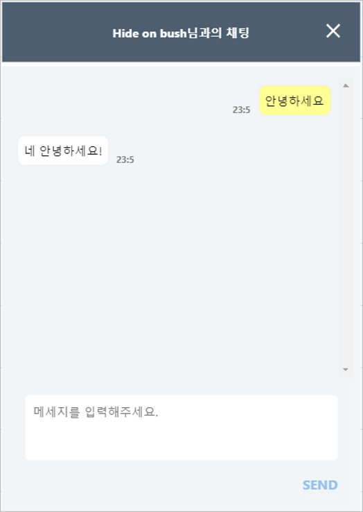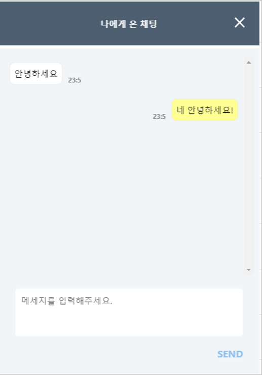

<br>

---
## 프로젝트 구조

---
> 사용한 기술 스택은 다음과 같습니다.
- Java 11
- Gradle 7
- SpringBoot 2.5.3
- Spring Security
- OAuth2, JWT
- Spring Data JPA
- QueryDSL
- JUnit5
- H2, MariaDB

> 패키지 구조 <br>
> 도메인 기반 패키지 구조를 사용했습니다.

```
lolup_project
    ├─auth
    ├─base
    ├─config
    ├─duo
    ├─exception
    ├─member
    ├─message
    ├─oauth
    ├─riotapi
    │  ├─match
    │  └─summoner
    └─token
```
- `auth` 패키지에는 클라이언트로부터 전달받는 다양한 권한 요청 로직들을 담았습니다.
- `oauth` 패키지에는 순수하게 소셜 로그인과 관련된 로직을 담았습니다.

<br>

---
## ERD & API

---
### ERD
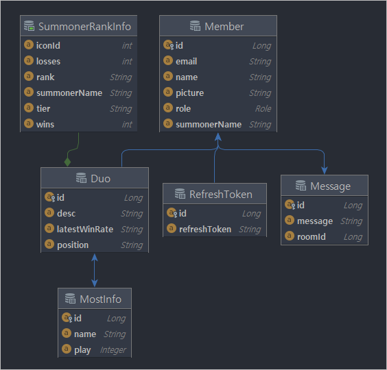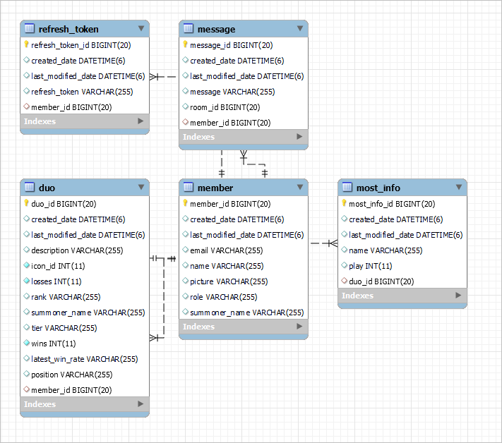

<br>

### API
> 프론트 팀원들에게 API 정보를 좀 더 효율적으로 전달해주기 위해 API 문서를 작성하게 되었습니다. <br>
> API 문서는 Spring Rest Doc을 활용해 작성했습니다.

API : http://lolup-api.p-e.kr/docs/guide.html

<br>

---

## Spring-Data-JPA & QueryDSL

---
### Mybatis에서 JPA로 리팩토링
> 수료이전에 해당 프로젝트를 MyBatis로 구현했었습니다. 다음과 같은 이유로 JPA로 리팩토링하게되었습니다.

- Mybatis 버전: https://github.com/khj1/lolup-backend-project/tree/1c465749ece5732e62bfefae8c2a6b8164419b25
- JPA 버전: https://github.com/khj1/lolup-backend-project

<br>

#### 1. 테스트 환경과 운영 환경 분리
- 개발과 테스트는 H2 Database를 통해, 운영 단계에선 MariaDB를 사용하고 싶었습니다.
- MyBatis를 사용하면 적용되는 DB마다 새로운 쿼리문을 작성해줘야 한다는 점이 불편했습니다.

<br>

#### 2. 비즈니스 로직에 집중하기 위해서
- MyBatis를 사용하면 새로운 엔티티를 추가할때 마다 단순한 CRUD 쿼리문을 반복적으로 작성해줘야하는 점이 불편했습니다.
- 단순 쿼리문 작업에서 벗어나 비즈니스 로직에 집중하고 싶었습니다.

<br>

#### 3. 유지보수의 번거로움
- MyBatis를 사용하면 엔티티 필드가 변경될 때마다 쿼리문도 변경해줘야하는게 번거로웠습니다.
- JPA를 사용하여 좀 더 객체 지향적으로 개발할 수 있다는 점이 좋았습니다.

<br>

### QueryDSL 사용을 위해 인터페이스 분리
- Duo (Domain class)
- DuoRepository (Spring-Data-JPA 인터페이스)
- DuoRepositoryCustom (QueryDSL 인터페이스)
- DuoRepositoryImpl (QueryDSL 인터페이스 구현체)


<br>

---
## OAuth2.0 + JWT (Login)

---
> 카카오/구글 소셜로그인 API를 활용해 별도의 회원가입 없이 서비스를 이용할 수 있도록 구현했습니다. <br>
> JWT 토큰을 사용해 Authorization Header 기반 인증 시스템을 구현했습니다.

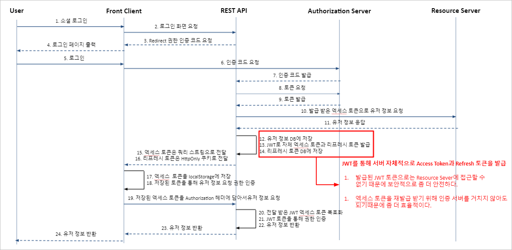
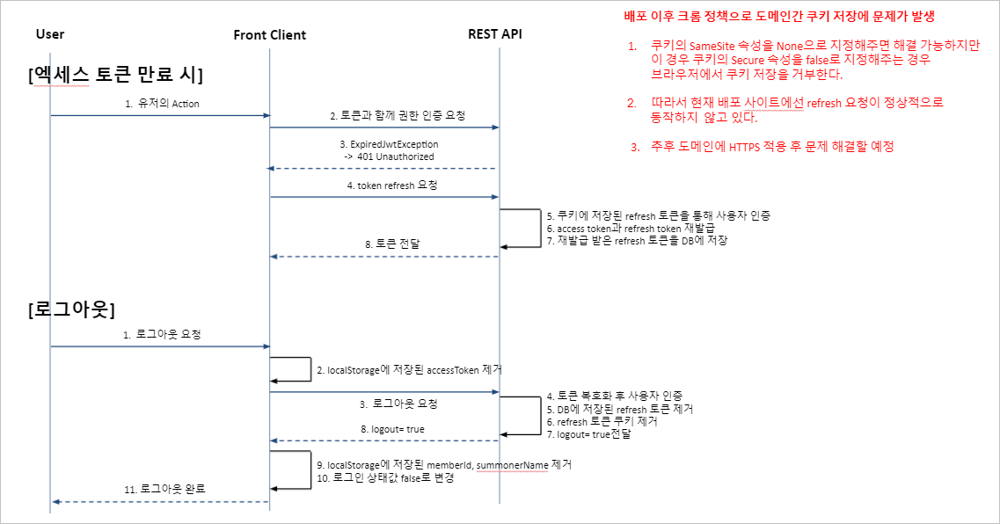


<br>

---
## Jasypt을 활용한 설정파일 암호화

---
> 자바 암호화 라이브러리인 Jasypt을 활용해서 주요 설정 정보를 암호화했습니다.

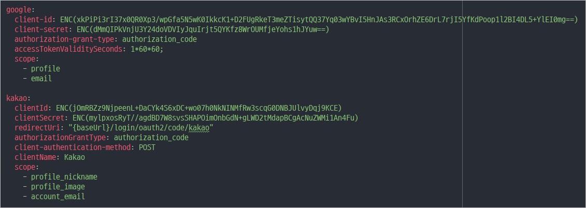

<br>

---
## CI/CD

---
### API Server
> Github-action, jenkins, Docker, AWS EC2를 활용해 CI/CD를 구현했습니다.


