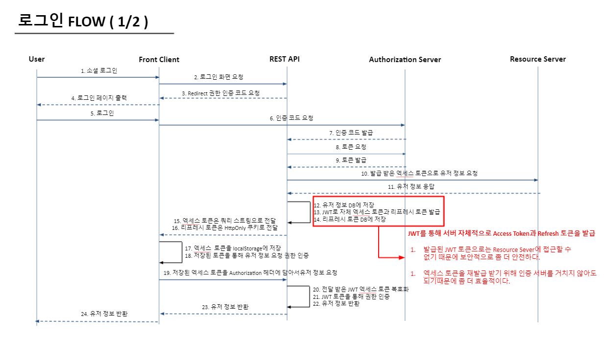
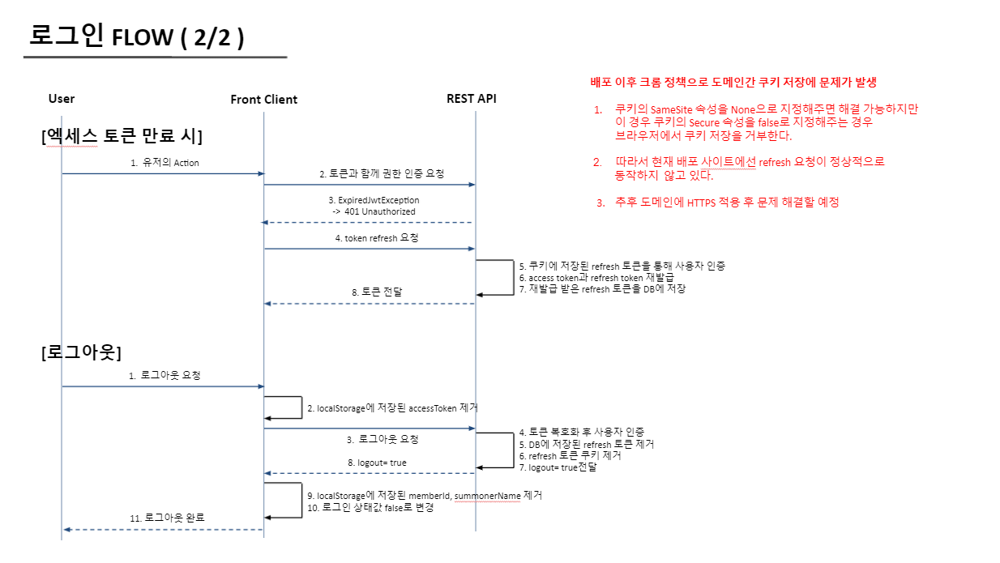
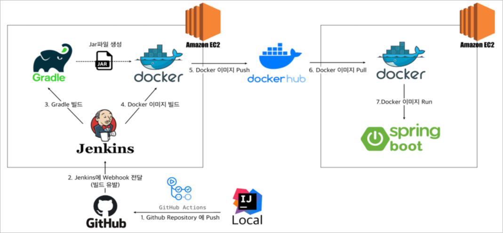

## 롤업 Backend
- Java 11
- Gradle 7
- SpringBoot 2.5.3
- Spring Security
- OAuth2
- Spring Data JPA
- Query DSL

---
### 소개
- [롤업](http://d2fh37v4sikqk8.cloudfront.net/) 은 [League of Legends](https://www.leagueoflegends.com/ko-kr/) 유저 매칭 서비스 입니다.
- 사용자는 롤업을 통해 같이 게임할 듀오를 모집할 수 있습니다.
- 사용자간 커뮤니케이션 및 실질적인 매칭은 채팅을 통해 이루어집니다.

### 구현 기능
- 소셜 로그인 기능 구현
- [RIOT API](https://developer.riotgames.com/apis) 를 활용하여 최신 유저 정보 반영
- StompJS, SockJS, 웹소켓을 활용한 간단한 채팅 기능 구현

 

#### 소셜 로그인

### CI/CD

